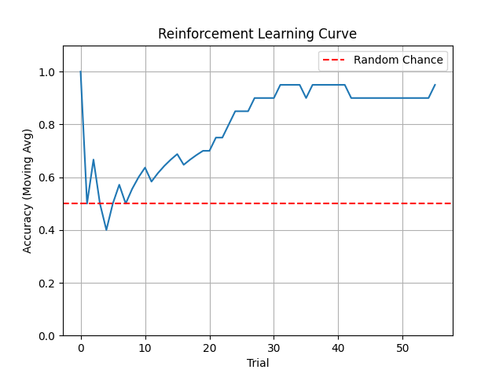

# 🧠 Neocortex-SNN-Logic

**Simulating Logic, Reasoning, and Executive Functions using Spiking Neural Networks (SNN).**

While the Hippocampus (previous project) handles "Memory", the Neocortex handles **"Computation"**.
This project aims to implement logical gates, working memory control, and reinforcement learning using biologically plausible neuron models on GPU.

---

## 🚀 Roadmap

- [x] **v0.1: XOR Logic Gate**
    - Proved that SNN can solve non-linear problems (XOR) using Interneurons (Lateral Inhibition).
- [x] **v0.2: Reinforcement Learning (R-STDP)**
    - Implemented **Reward-modulated STDP** using Eligibility Traces.
    - The network learns to map inputs to correct outputs through trial and error (Dopamine feedback).
- [ ] **v0.3: Working Memory Control**
    - Prefrontal Cortex (PFC) controlling Hippocampal memory retrieval.

## 🧪 Experiments

### v0.1: XOR Gate
**Location:** `v0.1_xor_logic/`
Solves the XOR problem using a microcircuit of Excitatory (RS) and Inhibitory (FS) neurons.
```bash
cd v0.1_xor_logic
python experiment_xor.py
```

### v0.2: Reinforcement Learning
**Location:** `v0.2_reinforcement_learning/`
The network learns a binary classification task (Input 0->Left, Input 1->Right) solely through reward feedback.
```bash
cd v0.2_reinforcement_learning
python experiment_rl.py
```
*   **Result**: The agent starts with random guesses (50% accuracy) and quickly converges to 100% accuracy after receiving dopamine rewards.


## 👤 Author

**Hafufu**
*   **note**: [https://note.com/cell_activation](https://note.com/cell_activation) (Research Log & Thoughts)
*   **Zenn**: [https://zenn.dev/cell_activation](https://zenn.dev/cell_activation) (Technical Articles & Implementation Details)