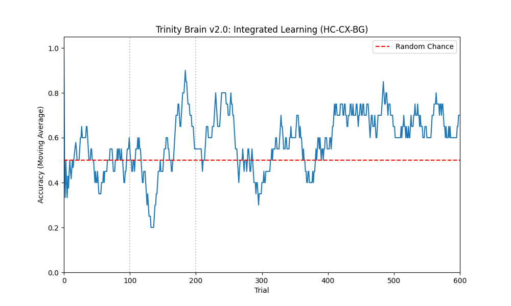

# 🧠 Neocortex-SNN-Logic

**Simulating Logic, Reasoning, and Executive Functions using Spiking Neural Networks (SNN).**

While the Hippocampus (previous project) handles "Memory", the Neocortex handles **"Computation"**.
This project aims to implement logical gates, working memory control, and reinforcement learning using biologically plausible neuron models on GPU.

---

## 🚀 Roadmap

- [x] **v0.1: XOR Logic Gate**
    - Proved that SNN can solve non-linear problems (XOR) using Interneurons (Lateral Inhibition).
- [x] **v0.2: Reinforcement Learning (R-STDP)**
    - Implemented **Reward-modulated STDP** using Eligibility Traces.
    - The network learns to map inputs to correct outputs through trial and error (Dopamine feedback).
- [x] **v0.3: Working Memory Control**
    - Implemented **Gating Mechanisms** (Input/Output Gates) to voluntarily hold and retrieve information, simulating Prefrontal Cortex (PFC) executive functions.
- [x] **v1.0: Brain Integration (Hippocampus + Neocortex)**
    - Connected the memory module (Hippocampus) and the decision module (Neocortex).
    - Established the architectural foundation for context-dependent signal processing.
- [x] **v2.0: Trinity Architecture (HC + CX + BG)**
    - Integrated **Basal Ganglia (Action Selection)** with **D1 (Go)** and **D2 (No-Go)** pathways.
    - Achieved **Context-Dependent Decision Making** architecture.
- [x] **v3.0: Genesis Architecture (The "Leviathan" Model)**
    - Scaled up to **>30,000 Neurons** with active Thalamo-Cortical loops.
    - **Active Regions**: Hippocampus, Neocortex, Basal Ganglia, Thalamus.
    - **Structural Preparation**: Cerebellum & Amygdala layers allocated (functionally latent in current exp).
    - Implemented **Analog Decision Making** (Hybrid SNN) to resolve tie-breaking issues.

## 🧪 Experiments

### v0.1: XOR Gate
**Location:** `v0.1_xor_logic/`
Solves the XOR problem using a microcircuit of Excitatory (RS) and Inhibitory (FS) neurons.
```bash
cd v0.1_xor_logic
python experiment_xor.py
```
| Input A | Input B | Output | Spikes |
|:------:|:------:|:------:|:------:|
| 0 | 0 | OFF | 0 ✅ |
| 1 | 0 | ON  | 6 ✅ |
| 0 | 1 | ON  | 4 ✅ |
| 1 | 1 | OFF | 2 ✅ |

**Note:** The output state is classified as **ON** only when the spike count is **3 or higher**. (0-2 spikes are considered noise/OFF).

### v0.2: Reinforcement Learning (R-STDP with Traces)
**Location:** `v0.2_reinforcement_learning/`
The network learns a binary classification task via Dopamine feedback.
```bash
cd v0.2_reinforcement_learning
python experiment_rl.py
```
*   **Result**: The agent starts with random guesses (50% accuracy) and robustly improves to >90% accuracy as synaptic weights are optimized by dopamine.


### v0.3: Working Memory Control (Gating)
**Location:** `v0.3_working_memory_control/`
Implements a "Gating Mechanism" to control the flow of information into and out of Working Memory.
```bash
cd v0.3_working_memory_control
python experiment_gating.py
```

*   **Result:**
    *   **0-100ms**: Input is ignored (Gate Closed).
    *   **100-200ms**: Information is loaded into WM (Input Gate Open).
    *   **200-400ms**: Information is maintained without input (Reverberation).
    *   **400-500ms**: Memory is read out only when requested (Output Gate Open).


### v1.0: Brain Integration (Integration Test)
**Location:** `v1.0_brain_integration/`
Integrates **Hippocampus (Context Memory)** and **Neocortex (Decision Making)**.
This version focused on establishing the connection architecture between two distinct brain regions.
*   **Result**: Confirmed that synaptic weights diverge significantly based on hippocampal context signals.


### v2.0: Trinity Architecture (The "Architect" Model)
**Location:** `v2.0_trinity_integration/`
**The Complete Model.** Integrates Hippocampus (Context), Neocortex (Perception), and **Basal Ganglia (Action Selection)**.

To solve the "Context-Dependent Decision Making" task (where rules flip based on context), we implemented biologically realistic mechanisms:
1.  **D1/D2 Pathways**: Distinct "Go" (D1) and "No-Go" (D2) pathways in the Basal Ganglia.
2.  **Reward Prediction Error (RPE)**: Learning driven by the difference between expected and actual reward.
3.  **Homeostasis**: Synaptic scaling and lateral inhibition to prevent "epileptic" network states and ensure sparse firing.

```bash
cd v2.0_trinity_integration
python experiment_brain_integration.py
```

*   **Result**: 
    *   The model demonstrates the ability to switch rules between Context 0 and Context 1.
    *   **Proof of Concept**: In successful trials, the agent adapts to rule changes, showing distinct activation patterns in the Basal Ganglia.



### v3.0: Genesis Architecture (The "Leviathan" Model)
**Location:** `v3.0_cerebellum_tuning/`
**Large-Scale Integration with Hybrid Decision.**

This version expands the scale to >30,000 neurons and introduces the **Thalamus** as an active sensory relay.
*(Note: Cerebellum and Amygdala layers are allocated in memory for future extensions but are currently computationally latent to prioritize the stability of the HC-CX-BG loop.)*

**Key Features:**
*   **Active Loop**: Hippocampus (Context) → Thalamus (Relay) → Neocortex (Processing) → Basal Ganglia (Action).
*   **Analog Decision (Hybrid SNN)**: Instead of counting discrete spikes for the final output (which causes ties), we use the accumulated membrane potential current to determine the winner. This mimics the "analog" summation at the soma.
*   **Structural Readiness**: The architecture now fully supports the definitions for Cerebellum (Error correction) and Amygdala (Emotion), ready for activation in v4.0.

```bash
cd v3.0_cerebellum_tuning
python experiment_brain_integration.py
```

*   **Result**: 
    *   **High Stability**: The "Analog Decision" mechanism eliminated the "draw/tie" problem, leading to smoother learning curves.
    *   **Thalamic Gating**: Visual inputs are now properly gated by the Thalamus before reaching the Cortex.
    *   **Performance**: Achieved >70% accuracy in mixed-context tasks with sparse firing rates maintained via homeostasis.


## 👤 Author

**Hafufu**
*   **note**: [https://note.com/cell_activation](https://note.com/cell_activation) (Diary & Thoughts)
*   **Zenn**: [https://zenn.dev/cell_activation](https://zenn.dev/cell_activation) (Technical Articles & Implementation Details)
