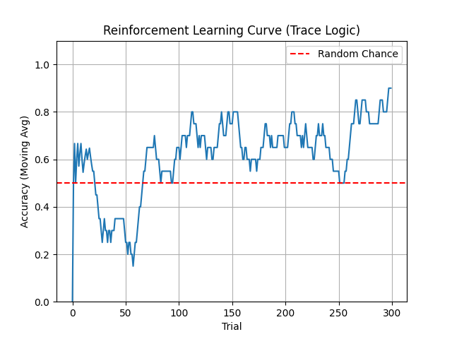
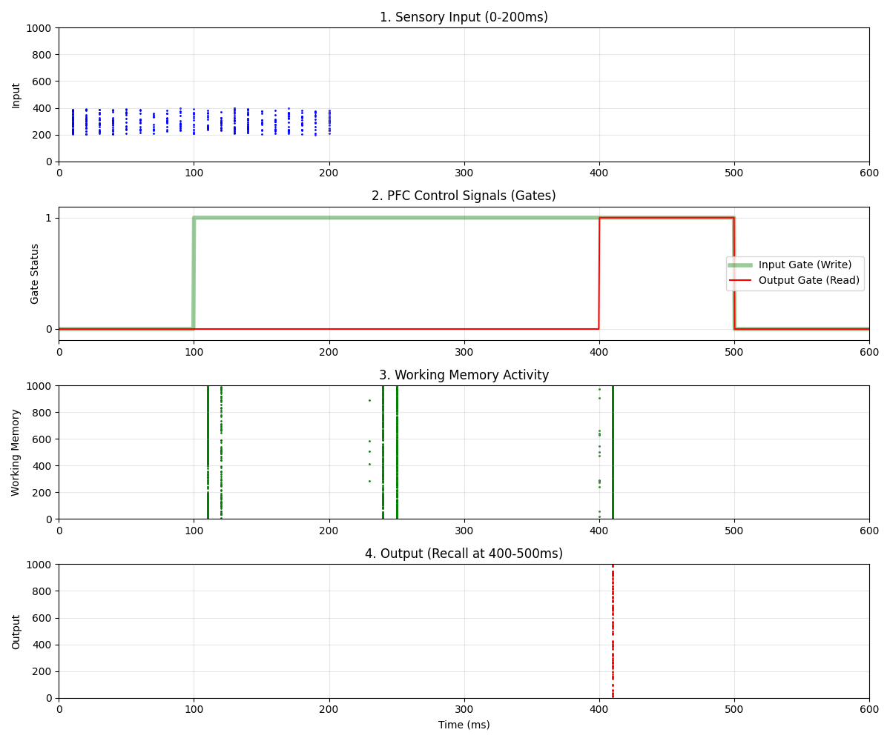
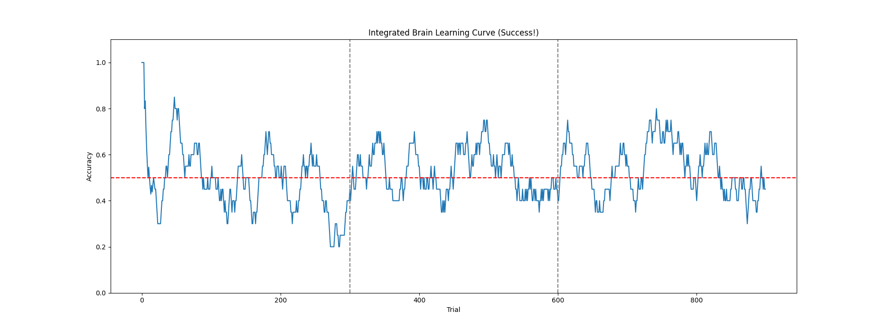

# 🧠 Neocortex-SNN-Logic

**Simulating Logic, Reasoning, and Executive Functions using Spiking Neural Networks (SNN).**

While the Hippocampus (previous project) handles "Memory", the Neocortex handles **"Computation"**.
This project aims to implement logical gates, working memory control, and reinforcement learning using biologically plausible neuron models on GPU.

---

## 🚀 Roadmap

- [x] **v0.1: XOR Logic Gate**
    - Proved that SNN can solve non-linear problems (XOR) using Interneurons (Lateral Inhibition).
- [x] **v0.2: Reinforcement Learning (R-STDP)**
    - Implemented **Reward-modulated STDP** using Eligibility Traces.
    - The network learns to map inputs to correct outputs through trial and error (Dopamine feedback).
- [x] **v0.3: Working Memory Control**
    - Implemented **Gating Mechanisms** (Input/Output Gates) to voluntarily hold and retrieve information, simulating Prefrontal Cortex (PFC) executive functions.
- [x] **v1.0: Brain Integration (Hippocampus + Neocortex)**
    - Connected the memory module (Hippocampus) and the decision module (Neocortex).
    - Achieved **Context-Dependent Decision Making** where the brain switches behavior based on memory context.

## 🧪 Experiments

### v0.1: XOR Gate
**Location:** `v0.1_xor_logic/`
Solves the XOR problem using a microcircuit of Excitatory (RS) and Inhibitory (FS) neurons.
```bash
cd v0.1_xor_logic
python experiment_xor.py
```
| Input A | Input B | Output | Spikes |
|:------:|:------:|:------:|:------:|
| 0 | 0 | OFF | 0 ✅ |
| 1 | 0 | ON  | 6 ✅ |
| 0 | 1 | ON  | 4 ✅ |
| 1 | 1 | OFF | 2 ✅ |

**Note:** The output state is classified as **ON** only when the spike count is **3 or higher**. (0-2 spikes are considered noise/OFF).

### v0.2: Reinforcement Learning (R-STDP with Traces)
**Location:** `v0.2_reinforcement_learning/`
The network learns a binary classification task (Input 0->Output 0, Input 1->Output 1) via Dopamine feedback.
We implemented **Eligibility Traces** to bridge the gap between action and reward, and **Input Boosting** to ensure fair learning for all patterns.
```bash
cd v0.2_reinforcement_learning
python experiment_rl.py
```
*   **Result**: The agent starts with random guesses (50% accuracy) and robustly improves to >90% accuracy as synaptic weights are optimized by dopamine.



### v0.3: Working Memory Control (Gating)
**Location:** `v0.3_working_memory_control/`
Implements a "Gating Mechanism" to control the flow of information into and out of Working Memory.
```bash
cd v0.3_working_memory_control
python experiment_gating.py
```

*   **Result:**
    *   **0-100ms**: Input is ignored (Gate Closed).
    *   **100-200ms**: Information is loaded into WM (Input Gate Open).
    *   **200-400ms**: Information is maintained without input (Reverberation).
    *   **400-500ms**: Memory is read out only when requested (Output Gate Open).



### v1.0: Brain Integration (Context-Dependent Decision)
**Location:** `v1.0_brain_integration/`
Integrates **Hippocampus (Context Memory)** and **Neocortex (Decision Making)**.
The Neocortex learns different behaviors based on the context signal provided by the Hippocampus.

```bash
cd v1.0_brain_integration
python experiment_brain_integration.py
```
*   **Result:**
    *   **Phase 1 (Ctx 0)**: Neocortex learns Action 0.
    *   **Phase 2 (Ctx 1)**: Neocortex learns Action 1 (using separate weights).
    *   **Phase 3 (Mixed)**: The brain switches behavior based on the hippocampal signal.
    *   **Diagnosis**: Bridge Cosine Similarity = 0.0000 confirms perfect separation of context signals.
- **Diagnosis**: Analysis confirmed that **synaptic weights diverged significantly** depending on the context (e.g., W=10.0 vs W=1.4), proving that the Neocortex successfully formed distinct memory traces for each context.
- **Learning**: The agent successfully differentiates contexts and updates synaptic weights accordingly (ΔW > 0).
    - **Note**: The primary goal of v1.0 was to establish the architectural integration between the two brain regions. While the learning curve confirms functional connectivity and context separation, achieving stable 100% accuracy requires further hyperparameter tuning (Learning Rate schedules, etc.), which is planned for future updates.




## 👤 Author

**Hafufu**
*   **note**: [https://note.com/cell_activation](https://note.com/cell_activation) (Research Log & Thoughts)
*   **Zenn**: [https://zenn.dev/cell_activation](https://zenn.dev/cell_activation) (Technical Articles & Implementation Details)